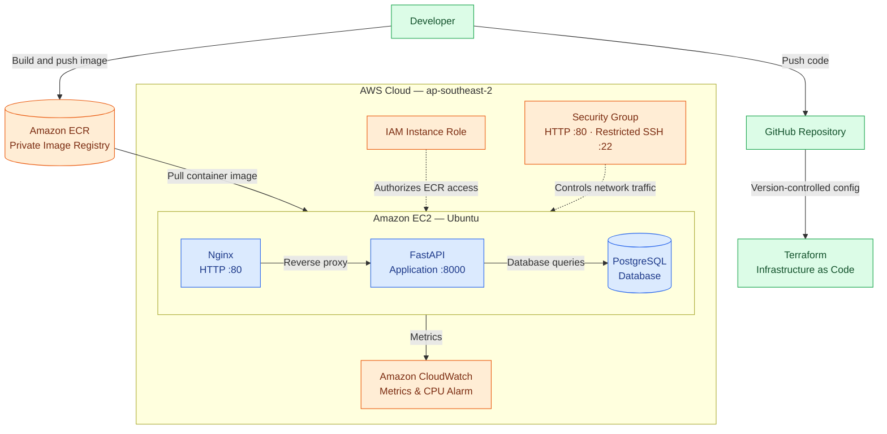

# CloudOps — AWS Infrastructure Automation

A cloud infrastructure and DevOps project demonstrating infrastructure as code, containerized application deployment, cloud security, and monitoring using AWS and Terraform.

## Overview
x

CloudOps deploys a containerized FastAPI application backed by PostgreSQL on AWS EC2. Terraform manages the infrastructure, Amazon ECR stores the application image, Nginx acts as a reverse proxy, and Amazon CloudWatch provides monitoring and alerting.

## Architecture


The diagram illustrates the application flow, container registry, Terraform, IAM, security group, and monitoring.

## Technology Stack

- **Cloud:** Amazon Web Services (AWS)
- **Infrastructure as Code:** Terraform
- **Containerization:** Docker and Docker Compose
- **Application:** Python, FastAPI
- **Database:** PostgreSQL
- **Container Registry:** Amazon ECR
- **Web Server / Reverse Proxy:** Nginx
- **Monitoring and Alerting:** Amazon CloudWatch
- **Version Control:** Git and GitHub
- **Operating System:** Ubuntu Linux

## AWS Resources

- **Amazon EC2:** Hosts the application and database containers.
- **Amazon ECR:** Stores the application container image.
- **AWS IAM:** Provides the EC2 instance role for accessing ECR.
- **Amazon VPC Security Group:** Controls inbound and outbound network traffic.
- **Amazon CloudWatch:** Collects EC2 metrics and supports CPU utilization alarms.

## Security Practices

- SSH access is restricted to a specific IPv4 address.
- HTTP traffic is allowed on port 80 for Nginx.
- The application port is not directly exposed through the security group.
- EC2 accesses ECR through an IAM role instead of embedded AWS credentials.
- ECR image scanning on push is enabled.
- Terraform uses `prevent_destroy` for the imported EC2 instance and security group.
- Terraform state files and local provider files are excluded from Git.

**Note:** HTTP is currently configured without HTTPS. A domain and TLS configuration are needed to enable HTTPS.

## Terraform Infrastructure Management

The Terraform configuration is located in the `terraform/` directory.

### Prerequisites

- Terraform installed locally
- AWS CLI installed and configured
- Appropriate AWS IAM permissions
- Git installed

### Initialize Terraform

```bash
cd terraform
terraform init
```

### Format and validate

```bash
terraform fmt
terraform validate
```

### Review infrastructure changes

```bash
terraform plan
```

Review the plan before applying any changes. Do not apply unexpected changes.

### Inspect tracked infrastructure

```bash
terraform state list
```

The current configuration tracks the ECR repository, EC2 instance, security group, and its three security group rules.

## Network Configuration

| Rule | Protocol / Port | Source or Destination |
|---|---|---|
| HTTP ingress | TCP 80 | `0.0.0.0/0` |
| SSH ingress | TCP 22 | Configured administrator IPv4 `/32` |
| Outbound | All protocols | `0.0.0.0/0` |

The FastAPI application is accessed through Nginx rather than direct public access to port 8000.

## Monitoring

Amazon CloudWatch is configured to monitor EC2 metrics, including CPU utilization, with a CPU alarm for resource monitoring.

## Repository Structure

```text
cloudops/
├── terraform/
│   ├── main.tf
│   └── .terraform.lock.hcl
├── .gitignore
└── README.md
```

Additional application and deployment files may exist elsewhere in the repository.

## Engineering Highlights

- Managed existing AWS infrastructure through Terraform imports.
- Defined security group rules as separate Terraform resources.
- Used Docker containers to deploy the API and database.
- Integrated an EC2 IAM role with Amazon ECR.
- Configured Nginx as a reverse proxy.
- Added CloudWatch monitoring and alerting.
- Used Git and GitHub to version-control infrastructure configuration.

## Safety Notes

- Never commit AWS credentials, private keys, passwords, `.env` files, or Terraform state files.
- Review every Terraform plan before applying changes.
- Keep SSH access restricted to your current trusted IP address.
- Review AWS costs and stop non-production EC2 instances when they are not needed.

## Project Status

The current Terraform configuration has been validated, and `terraform plan` reports no infrastructure changes.

---

**Project:** CloudOps — AWS Infrastructure Automation  
**Focus Areas:** Cloud Engineering, DevOps, Infrastructure as Code, Containerization, Security, and Monitoring
